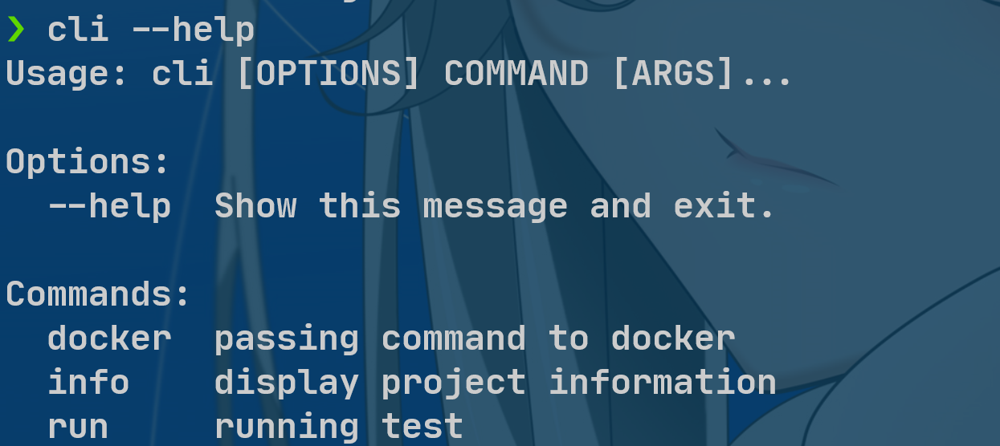

<h1 align="center">Welcome to T3 👋</h1>

  
  

> UAF检测

### 🏠 [Homepage](https://github.com/WHU-SoftwareSecurity/final)

## Introduction

该仓库用作实现2018级武汉大学国家网络安全学院软件安全T3 project

## Usage

## Author

👤 **Group 8**

* Github: [@WHU-SoftwareSecurity ](https://github.com/WHU-SoftwareSecurity )
